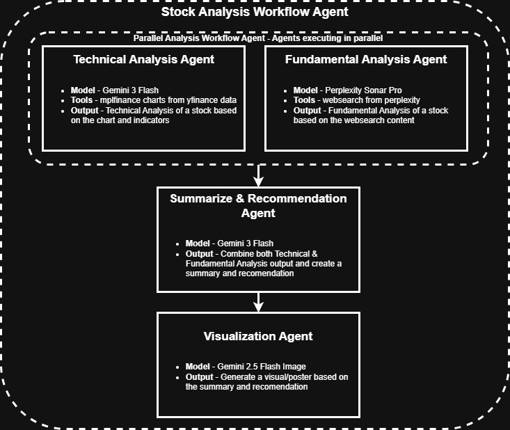
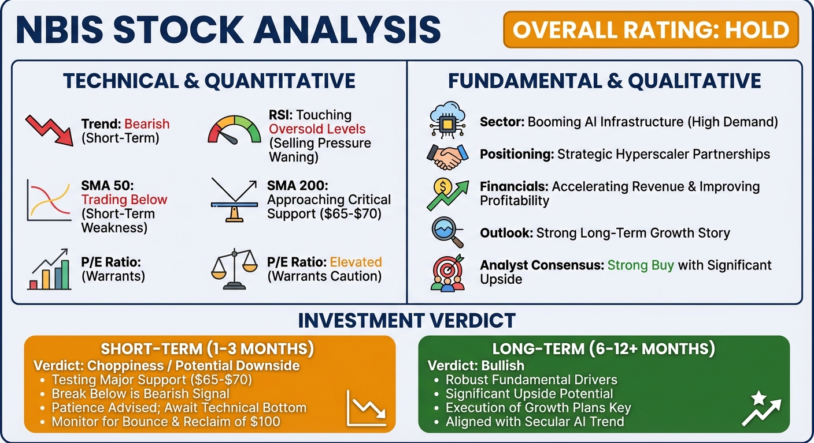

# AI Stock Research Agent

A comprehensive multi-agent AI system that performs deep research on stock tickers. By orchestrating specialized agents for technical analysis, fundamental research, and data visualization, this tool generates detailed reports and visual summaries to aid investment decisions.

## 🚀 Features

- **Multi-Agent Architecture**: Built on the Google Agent Development Kit (ADK), coordinating specialized agents for distinct tasks.
- **Technical Analysis**: Analyzes historical price data and technical indicators using `gemini-3-flash-preview`.
- **Fundamental Analysis**: Conducts real-time web research on company news, earnings, and market sentiment using `perplexity/sonar-pro`.
- **Intelligent Synthesis**: Combines technical and fundamental insights into a cohesive investment recommendation.
- **Visual Reporting**: Generates a final visual dashboard with charts and key takeaways using `gemini-3-pro-image-preview`.
- **Automated Outputs**: Produces both Markdown reports and image files for easy sharing and review.

## Solution


## 💡 Key Technical Aspects

- **Advanced Multi-Modality**: Leverages vision capabilities at both ends of the pipeline.
    - *Input*: Uses vision models to "see" and interpret technical stock charts just like a human analyst.
    - *Output*: Generates rich, visual dashboards/posters instead of just plain text summaries.
- **Strategic Model Selection**: Orchestrates the best models for specific tasks.
    - *Gemini*: Utilized for complex visual reasoning, data consolidation, and creative output generation.
    - *Perplexity*: Deployed for deep, real-time financial research and fact-checking.
- **Data Fusion**: Seamlessly integrates **structured data** (OHLC prices, technical indicators) with **unstructured data** (news articles, earnings call transcripts, market sentiment).
- **Hybrid Analysis**: Combines **deterministic** quantitative analysis (math-based indicators) with **probabilistic** qualitative reasoning (LLM-based insights) for a holistic view.


## Sample Results (as of 12/24/2025)




## 🛠️ Prerequisites

- **Python 3.12+**
- **uv** (recommended for dependency management) or `pip`
- **API Keys**:
  - Google GenAI API Key (for Gemini models)
  - Perplexity AI API Key (for Sonar models)

## 📦 Installation

1.  **Clone the repository**
    ```bash
    git clone <repository-url>
    cd ex_stock_research_1
    ```

2.  **Install dependencies**
    Using `uv` (recommended):
    ```bash
    uv sync
    ```
    
3.  **Configure Environment Variables**
    Create a `.env` file in the root directory (or rename `tmp.env` if available) and add your API keys:

    ```env
    GOOGLE_API_KEY=your_google_api_key_here
    PERPLEXITYAI_API_KEY=your_perplexity_api_key_here
    GOOGLE_GENAI_USE_VERTEXAI=FALSE
    ```

## 🏃‍♂️ Usage

1.  **Set the Ticker**
    Currently, the target stock ticker is configured in `main.py`. Open the file and modify the `ticker` variable:

    ```python
    # main.py
    ticker = "NBIS"  # Change "NBIS" to your desired ticker (e.g., "AAPL", "NVDA")
    ```

2.  **Run the Agent**
    Execute the main script to start the analysis pipeline:

    ```bash
    python main.py
    ```

3.  **View Results**
    After the analysis completes, check the `outputs/` directory for the generated artifacts:
    - `{TICKER}_output.md`: A consolidated Markdown report containing the detailed analysis from all agents.
    - `{TICKER}_output.png` (or .jpeg): A visual summary dashboard generated by the Visualization Agent.
    - `{TICKER}_chart_{date}.png`: The raw technical chart used for analysis.

## 📂 Project Structure

- `main.py`: Entry point of the application. Handles session management and agent execution.
- `stock_analysis_agent/`: Contains the agent definitions, prompts, and workflow logic.
  - `agent.py`: Defines the `root_agent` and sub-agents (Technical, Fundamental, Summary, Visualization).
  - `prompts.py`: Stores the system instructions for each agent.
- `tools/`: Custom tools used by the agents (e.g., for fetching stock data).
- `outputs/`: Directory where generated reports and images are saved.

## 🤝 Contributing

Contributions are welcome! Please feel free to submit a Pull Request.

1.  Fork the repository.
2.  Create your feature branch (`git checkout -b feature/AmazingFeature`).
3.  Commit your changes (`git commit -m 'Add some AmazingFeature'`).
4.  Push to the branch (`git push origin feature/AmazingFeature`).
5.  Open a Pull Request.

## 🆘 Support

If you encounter any issues or have questions, please open an issue in the repository.
