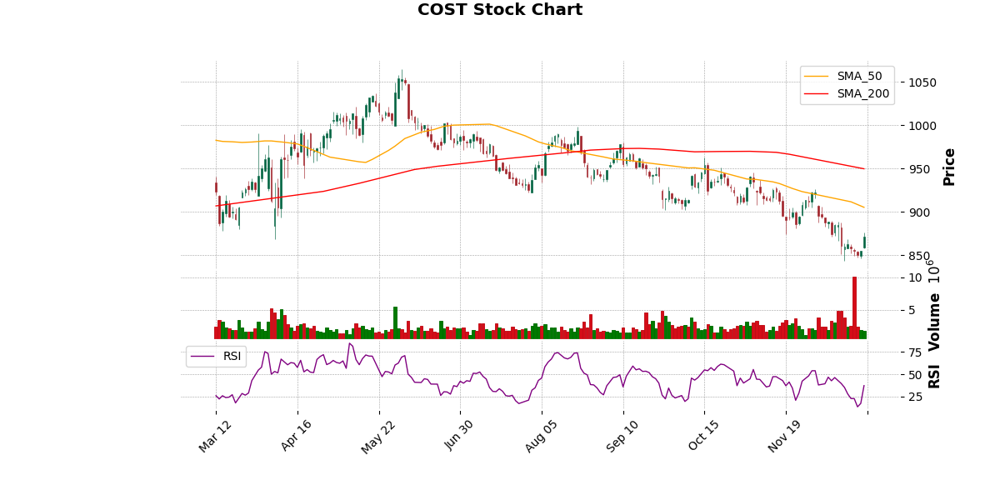
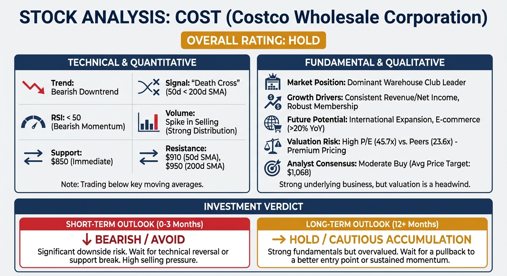

# Analysis of COST done on 12/24/2025

# Stock chart of COST used for Technical Analysis

# technical_analysis_agent

Based on the provided chart for COST, here is a technical analysis:

### **1. Price Action and Trend Analysis**
*   **Overall Trend:** The stock is currently in a primary **downtrend**. After peaking at approximately $1,050 in late May, the price has consistently formed lower highs and lower lows.
*   **Current Positioning:** The stock is trading near the bottom of its recent range, specifically around the **$850 - $870** level. There has been a small recent bounce, but the overall trajectory remains negative.

### **2. Moving Averages (SMA)**
*   **Death Cross:** A "Death Cross" occurred in late August when the **50-day SMA (Orange)** crossed below the **200-day SMA (Red)**. This is a long-term bearish signal indicating that momentum has shifted to the downside.
*   **Resistance Levels:** The 50-day SMA is currently acting as a dynamic resistance level near **$910**. The 200-day SMA is situated higher, around **$950**, representing a significant hurdle for any potential recovery.

### **3. RSI (Relative Strength Index)**
*   **Momentum:** The RSI is currently hovering around **40**. It recently dipped into "oversold" territory (below 30) before its current slight uptick. 
*   **Interpretation:** While the RSI bounce suggests a temporary relief rally, the fact that it remains below the 50 centerline indicates that the bears are still in control of the overall momentum.

### **4. Volume Analysis**
*   **Selling Pressure:** There is a very notable **spike in selling volume** (large red bar) near the end of the chart. This suggests a period of heavy institutional or mass retail distribution, which often precedes further consolidation or a continued decline.

### **5. Key Support and Resistance**
*   **Immediate Support:** $850. This is the recent local low where buyers stepped in.
*   **Immediate Resistance:** $910 (50-day SMA).
*   **Major Resistance:** $950 (200-day SMA and previous consolidation zone).

### **Summary Conclusion**
The technical outlook for COST is **bearish**. The stock is trading below both its 50-day and 200-day moving averages, and the "Death Cross" confirms a long-term downward trend. While the oversold RSI levels provided a small bounce, the massive spike in selling volume indicates high risk. A reversal would require the stock to break and hold above the 50-day SMA with increasing buy volume.

# fundamental_analysis_agent

<scratchpad>
1. **Key Valuation Metrics Context**: P/E at 45.7x is high vs peers (23.6x avg) and historical; premium pricing reflects growth expectations but leaves little margin for error [2][8].
2. **Recent Financial Performance Context**: Revenue up 8% FY2025 to $275B, net income +10% to $8.1B; stable growth driven by new stores (24 added), membership fees; not accelerating rapidly [3].
3. **Profitability Context**: Net margins improving gradually (peaked 3.72% in 2024), ROE strong and rising; outperforms peers due to efficient model [4][10].
4. **Analyst Outlook**: Moderate Buy consensus (19 Buy, 11 Hold); avg PT $1,068 (14.6% upside from ~$932); watching membership growth, e-comm [5][2].
5. **Sector Analysis**: Warehouse retail strong; Costco dominates >60% US share; trends: value-seeking consumers, e-comm pressure, competition from Sam's/BJ's/Amazon [6][12].
6. **Growth Prospects**: International expansion, e-comm surge (20%+ YoY), services/digital; risks: high valuation, digital lag, saturation [7][13].
</scratchpad>

<analysis>

## Key Valuation Metrics Context
- P/E ratio (45.7x) high vs peers (23.6x avg) and industry (21.3x) [2][8].
- Trades at premium to historical levels, signaling growth priced in [2].
- Debt/Equity low, supporting fair balance sheet strength [2].

## Recent Financial Performance Context
- Revenue stable at 8% growth FY2025 ($275B), TTM trends steady [3][10].
- Net income up 10% to $8.1B over 3 years, driven by store adds and fees [3][4].
- Not accelerating; resilient amid economic uncertainty [3].

## Profitability Context
- Margins gradually improving (net ~3% peak), stable ROE trajectory upward [4][10].
- Outperforms peers via efficient ops, Kirkland brand [4].
- Strong vs competitors like Walmart Sam's Club [8].

## Analyst Outlook
- Moderate Buy: 19 Buy, 11 Hold from 30 analysts [2].
- Avg price target $1,068 (15% upside from $932) [5][2].
- Key watches: membership renewal, e-comm sales, fees [5].

## Sector Analysis
- Warehouse club sector robust on value demand [6].
- Costco leads with 60%+ US share, loyalty model edge [6][12].
- Trends: e-comm rise, inflation favors bulk; rivals Sam's/BJ's [12].

## Growth Prospects and Future Outlook
- Drivers: global stores, e-comm (20%+ growth), services expansion [13][7].
- Risks: valuation stretch, digital gaps vs Amazon [7][8].
- Long-term positive: membership stability, international whitespace [13].

</analysis>

# summary_recommendation_agent

## Investment Recommendation: **HOLD**

### Short-Term Prediction:
The short-term outlook for Costco (COST) is **bearish**. Technical indicators suggest continued downward pressure. The stock is in a downtrend, trading below key moving averages (50-day and 200-day SMA), with a bearish "Death Cross" signal. The recent spike in selling volume is a significant concern, indicating strong distribution. Immediate resistance lies at the 50-day SMA ($910) and then the 200-day SMA ($950). The RSI, while slightly off oversold levels, remains below 50, confirming bearish momentum. A break below the $850 support level could lead to further declines.

### Long-Term Prediction:
The long-term outlook remains **cautiously optimistic, leaning towards a HOLD**. Fundamentally, Costco is a strong company with a dominant market position in the warehouse club sector, benefiting from consumer value-seeking trends. Its consistent revenue and net income growth, improving profitability, and robust membership model are positive long-term drivers. International expansion and e-commerce growth (currently over 20% YoY) offer further upside potential.

However, the current high valuation (P/E of 45.7x vs. peer average of 23.6x) presents a significant risk. This premium pricing implies high growth expectations, leaving little room for error. While analysts have a moderate "Buy" consensus with an average price target suggesting upside, the technical picture indicates a period of consolidation or further decline before potential recovery.

### Rationale:
The HOLD recommendation is based on the conflict between the bearish short-term technical signals and the strong long-term fundamental picture.

*   **Technical Bearishness:** The clear downtrend, death cross, and high selling volume suggest that the stock may continue to decline in the near term. Entering a new position or adding to an existing one in this environment carries significant risk.
*   **Fundamental Strength:** Costco's underlying business remains robust, supported by its market leadership, efficient operations, and growth avenues. This provides a solid foundation for a long-term recovery.
*   **Valuation Concerns:** The high P/E ratio acts as a headwind and suggests that the stock may be overvalued relative to its current fundamentals and growth rate, especially given the recent technical weakness.

Therefore, current shareholders are advised to HOLD, waiting for a clearer technical signal of reversal or a more attractive entry point. New investors should consider waiting for the stock to break key resistance levels and demonstrate sustained buying momentum, or for a potential pullback to a more reasonable valuation, before initiating a position. The average analyst price target of $1,068 indicates potential upside, but the current technicals and valuation suggest this is unlikely in the immediate short term.

# visualization_agent

