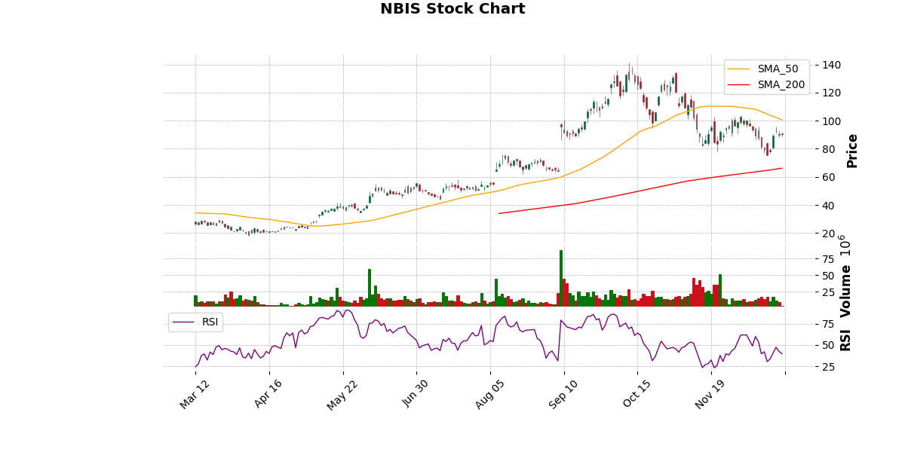

# Analysis of NBIS done on 12/24/2025

# Stock chart of NBIS used for Technical Analysis

# technical_analysis_agent

Based on the provided NBIS technical stock chart, here is a professional technical analysis:

### **1. Price Trend and Moving Averages**
*   **Overall Trend:** The stock exhibited a strong bullish trend from March through September, peaking near **$140**. However, since October, it has entered a significant corrective phase or downtrend.
*   **SMA 50 (Yellow Line):** This short-term trend indicator has flattened and is now sloping downward. Crucially, the price broke below the SMA 50 in early November and has remained below it, which is a **bearish signal** indicating short-term weakness.
*   **SMA 200 (Red Line):** The long-term trend remains positive as the SMA 200 is still sloping upward. The price is currently approaching this level (roughly around **$65-$70**), which often acts as a major support floor in long-term bull markets.

### **2. Momentum Indicators (RSI)**
*   **RSI (Relative Strength Index):** The RSI is currently hovering in the **40-50 range**, which is considered neutral territory. 
*   It reached "overbought" levels (above 70) several times during the run-up (May, August, and September), which preceded the current correction. 
*   The RSI recently touched the "oversold" boundary (near 30) in late November, suggesting the selling pressure may be exhausting, though it has not yet signaled a strong reversal.

### **3. Volume Analysis**
*   Significant volume spikes (green bars) were noted during the gap-ups in early August and September, confirming strong institutional buying during those periods.
*   The recent decline has seen periods of elevated volume on "down" days (red bars), indicating that sellers have been in control for the past two months.

### **4. Key Support and Resistance Levels**
*   **Immediate Resistance:** The **$100 level** is a psychological barrier and aligns closely with the declining SMA 50. The stock needs to reclaim this level to shift the short-term sentiment back to bullish.
*   **Immediate Support:** Recent price action shows a floor around **$80**. 
*   **Major Support:** If $80 fails, the primary target for support is the **SMA 200 near $65-$70**.

### **Technical Summary**
The chart shows a stock that is currently in a **distribution or correction phase** after a parabolic run. While the long-term trend (SMA 200) is still intact, the short-term outlook is **bearish** as long as the price stays below the 50-day moving average. Traders would likely look for a "bounce" or consolidation near the SMA 200 as a potential entry point, while a break below the SMA 200 would signal a more severe trend reversal.

# fundamental_analysis_agent

<scratchpad>
NBIS is Nebius Group, an AI infrastructure/cloud company (formerly Yandex parts), focused on GPU clusters, AI cloud, with subsidiaries in data/AI (Toloka), edtech (TripleTen), AV (Avride). High-growth AI play.

1. Valuation: High P/E ~95x vs peers (e.g., industry ~27-76x), premium due to growth but elevated historically; P/B fair at 4.7x vs peer avg 17.9x [17][2].

2. Financial perf: Revenue low recently ($20-363M TTM) but accelerating in AI shift from legacy; net income volatile (positive TTM $218M after losses) driven by AI infra investments, hyperscaler deals [2][4].

3. Profitability: Margins/net improving to 99% net margin outlier vs peers like NetEase 31%; ROE mixed (6% vs peers higher, past negative) but stabilizing with cash position [5][3].

4. Analyst: Strong Buy consensus (5-14 analysts), PT $154-157 (66-74% upside), watching AI contracts, ARR growth to $7-9B by 2026 [6][13][20].

5. Sector: AI/cloud booming, NBIS strong in neo-cloud/GPU via MSFT/Meta deals; competitive vs hyperscalers but differentiated full-stack [9][7].

6. Growth: High prospects via AI demand, expansions (1GW power), risks: debt/execution, capex heavy; long-term bullish [8].
</scratchpad>

<analysis>

## Key Valuation Metrics Context
- P/E elevated at ~95x vs industry 27-76x, reflecting growth premium but high vs historical [2][5].
- P/B fair at 4.7x below peer average 17.9x [17].
- Debt/Equity low post-restructuring, strong cash position supports fair rating amid AI hype [4].

## Recent Financial Performance Context
- Revenue accelerating from low base ($13-363M TTM), shifting to AI infra from legacy ops [2][4].
- Net income volatile but positive TTM ($218M), driven by hyperscaler contracts offsetting investments [2].
- Trends upward in AI era, decelerated pre-spin-off due to restructuring [4].

## Profitability Context
- Margins sharply improving to 99% net (outlier vs NetEase 31%), from prior losses [5].
- ROE stabilizing at 6% (better than past negative, lags some peers at 23%) [5][3].
- Trends positive with scale, superior cash flow supports edge over competitors [4].

## Analyst Outlook
- Strong Buy consensus from 5-14 analysts [6][13].
- Avg price target $154-157 (66-74% upside from ~$92) [6][2].
- Key watches: ARR growth to $7-9B '26, MSFT/Meta deals, AI execution [13].

## Sector Analysis
- AI infrastructure sector hot with GPU/cloud demand surge [7].
- NBIS competitively positioned via full-stack AI cloud, neo-clouder vs hyperscalers [9].
- Trends: Hyperscaler partnerships, physical AI/robotics expansion favor NBIS [16].

## Growth Prospects and Future Outlook
- Drivers: AI workloads boom, 1GW capacity target, $900M-$1.1B ARR '25 .
- Risks: High capex, competition, tariff/execution hurdles [8].
- Long-term strong: Hyperscale deals position for multi-year dominance [7].

</analysis>

# summary_recommendation_agent

## Investment Recommendation: Hold

**Rationale:**

NBIS presents a compelling long-term growth story within the booming AI infrastructure sector. Its strategic positioning with hyperscaler partnerships, accelerating revenue, and improving profitability metrics are significant positives. However, the current technical picture indicates a short-term bearish trend, with the stock trading below its 50-day moving average and approaching a critical long-term support level.

While fundamental factors strongly support a long-term "Buy" thesis, the immediate technical weakness suggests that further downside risk exists in the short term. The elevated P/E ratio also warrants caution, implying that much of the company's future growth is already priced in.

Therefore, a "Hold" recommendation is appropriate at this juncture. Investors should monitor the stock's behavior around the $65-$70 support level (SMA 200) and look for technical confirmation of a bottoming pattern before considering adding to positions. The strong analyst consensus and high price targets indicate significant upside potential, but patience is advised given the current technical headwinds.

**Short-Term Prediction (1-3 months):**

The stock is likely to experience **continued choppiness and potential further downside** as it tests the major support around the $65-$70 level (SMA 200). A break below this level would be a strong bearish signal, potentially leading to further declines. Conversely, a successful bounce off this support, accompanied by a reclaim of the $100 resistance level and the 50-day moving average, could signal the end of the correction and a potential resumption of the uptrend. The RSI touching oversold levels suggests selling pressure may be waning, but a clear reversal signal is still absent.

**Long-Term Prediction (6-12+ months):**

The long-term outlook for NBIS remains **bullish**. The fundamental drivers, including the insatiable demand for AI infrastructure, NBIS's competitive positioning, and its expanding capacity, are robust. Analysts have a strong buy consensus and project significant upside. If NBIS can successfully execute on its growth plans, secure further hyperscaler deals, and manage its capital expenditures effectively, the stock has the potential to reach and even surpass analyst price targets in the medium to long term. The company's shift towards AI infrastructure is a strategic move that aligns it with a secular growth trend.

# visualization_agent

