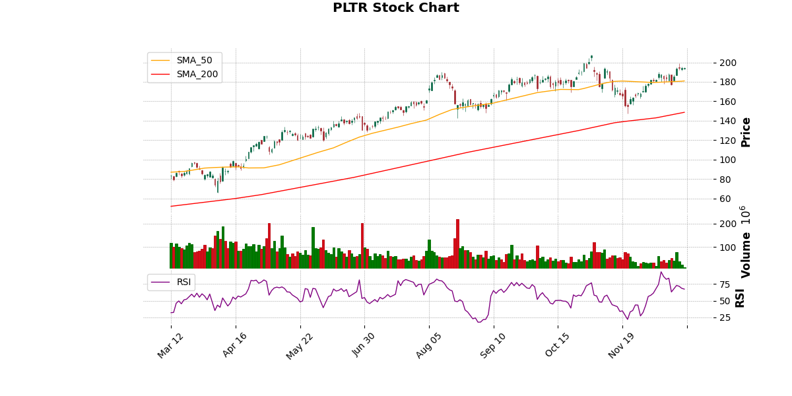
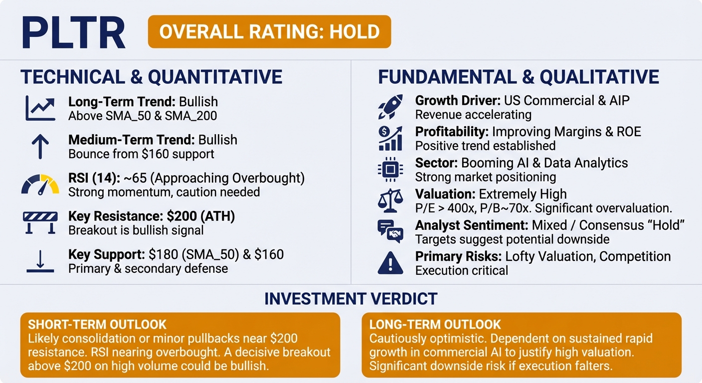

# Analysis of PLTR done on 12/24/2025

# Stock chart of PLTR used for Technical Analysis

# technical_analysis_agent

Based on the provided PLTR stock chart, here is a technical analysis of the stock's performance:

### **Trend Analysis**
*   **Long-Term Trend:** Bullish. The stock is in a clear long-term uptrend, as evidenced by the price staying consistently above the upward-sloping **200-day Simple Moving Average (SMA_200)**, currently positioned around $150.
*   **Medium-Term Trend:** Bullish. The price is currently trading above the **50-day SMA (SMA_50)**, which is also sloping upward at approximately $180. The recent bounce off the $160 level confirms that the medium-term momentum remains positive.

### **Key Technical Indicators**
*   **Moving Averages:** The "Golden Cross" (where the SMA_50 is above the SMA_200) occurred long before this chart starts, and the gap between them remains wide, indicating strong sustained momentum. The SMA_50 acted as a support level throughout much of the year, although there was a brief "false breakdown" in mid-November.
*   **Relative Strength Index (RSI):** The RSI is currently near **65**, approaching the "overbought" threshold (70). This suggests strong buying momentum, though it may be nearing a point where a short-term consolidation or minor pullback could occur. Notably, the RSI hit an "oversold" level (below 30) in mid-November, which perfectly timed the recent price bottom.
*   **Volume:** Volume spikes were most prominent during the mid-August and late-October price swings. Recent volume during the December recovery has been steady, though lower than the major peak in August, suggesting the current move is healthy but not yet a parabolic breakout.

### **Support and Resistance Levels**
*   **Resistance:** The immediate resistance level is at the previous all-time high near **$200**. A sustained break above this level would likely signal the next leg of the rally.
*   **Support:**
    *   **Primary Support:** The **SMA_50 (~$180)** currently serves as the first line of defense.
    *   **Secondary Support:** The **$160** mark, which was the bottom of the November correction.
    *   **Major Floor:** The **SMA_200 (~$150)** represents strong long-term structural support.

### **Summary Outlook**
The chart shows a strong, healthy uptrend. After a sharp correction in mid-November to $160, the stock has rebounded forcefully. As long as PLTR stays above its SMA_50 ($180), the path of least resistance remains upward, with a retest of the **$200** resistance level likely in the near term. Investors should watch for a breakout above $200 on high volume for further confirmation of the bullish trend.

# fundamental_analysis_agent

<scratchpad>
1. Key Valuation Metrics Context: High/expensive vs historical and peers (P/E 400+, P/B 70x, overvalued by 90% per some models); elevated due to AI hype.

2. Recent Financial Performance Context: Accelerating revenue growth (TTM ~$3.9B, 40-120% YoY in segments, esp US commercial); driven by AIP platform, AI demand; net income improving from losses to positive.

3. Profitability Context: Improving sharply (margins >20-28%, ROE from negative to 9-18%); better than many software peers.

4. Analyst Outlook: Hold consensus; avg PT $140-170 (downside from ~$190); mix sell/hold/buy; watching AI execution, valuation.

5. Sector Analysis: AI/data analytics booming (market to $310B by 2034); PLTR strong in gov/commercial, AIP competitive edge; trends: agentic AI, real-time analytics.

6. Growth Prospects: Strong drivers (AIP, US commercial 50%+ growth); risks: high valuation, competition; long-term bright via AI trends.
</scratchpad>

<analysis>

## Key Valuation Metrics Context
- Valuation ratios elevated vs historical averages and software peers [2][14][25].
- P/E over 400x, P/B ~70x signal premium pricing amid AI enthusiasm [20][26].
- Seen as overvalued by 90% relative to fundamentals by some models [2].

## Recent Financial Performance Context
- Revenue accelerating, TTM ~$3.9B with 40-120% YoY segment growth [3][15][19].
- US commercial surging 121% Y/Y, government steady; driven by AIP demand [7][19].
- Net income trends from losses to profitable, fueled by AI platform adoption [4][9].

## Profitability Context
- Margins improving sharply to 21-28% operating/net; ROE from negative to 9-18% [4][8][10].
- Outperforms many peers in ROA/ROE/ROIC rankings [8][16][28].
- Reflects scaling efficiency and cost discipline [10].

## Analyst Outlook
- Consensus "Hold" from 20+ analysts; 2 sell, 15 hold, 5 buy [5][17][29].
- Avg price target $140-170, implying 10-25% downside from ~$190 [5][17].
- Key watches: AI execution, commercial growth, valuation sustainability [11].

## Sector Analysis
- AI data analytics sector exploding to $310B by 2034; trends include agentic AI, real-time IoT [6][12].
- PLTR competitively positioned with AIP in gov/commercial; leads in enterprise AI deployment [6][7].
- Favorable tailwinds from BFSI, healthcare, defense demand [6].

## Growth Prospects and Future Outlook
- Drivers: AIP expansion, 50%+ US growth, generative AI market [7][13][15].
- Risks: lofty valuation, execution in volatile AI space, competition [7].
- Long-term strong via AI infrastructure dominance [7][13].

</analysis>

# summary_recommendation_agent

## Investment Recommendation: Hold

**Rationale:**

Palantir (PLTR) presents a dichotomy between strong technical momentum and fundamental overvaluation, creating a balanced case for a "Hold" recommendation.

**Technical Analysis Summary:**
The technical picture for PLTR is predominantly bullish. The stock is in a clear long-term uptrend, trading above both its 50-day and 200-day Simple Moving Averages (SMAs). The recent bounce from the $160 support level and the upward trajectory of the SMAs suggest continued positive momentum. The Relative Strength Index (RSI) near 65 indicates strong buying interest but is approaching overbought territory, hinting at a potential short-term consolidation. Key resistance is identified at the $200 all-time high, with support around the $180 (SMA_50) and $160 levels. A breakout above $200 on significant volume would be a strong bullish signal.

**Fundamental Analysis Summary:**
Fundamentally, PLTR is showing impressive growth, particularly in its US commercial segment driven by its Artificial Intelligence Platform (AIP). Revenue is accelerating, and profitability is improving significantly, with margins and ROE showing positive trends. The company operates in a booming AI and data analytics sector, positioning it well for future growth. However, these strengths are overshadowed by extremely high valuation metrics (P/E over 400x, P/B ~70x), suggesting the stock is significantly overvalued relative to its current fundamentals. Analyst sentiment is mixed, with a consensus "Hold" and price targets suggesting a potential downside from current levels. The primary risks are the lofty valuation and intense competition within the AI space.

**Synthesis and Recommendation:**

The strong technical uptrend suggests that the market is currently favoring PLTR, and further upside is possible, especially if the $200 resistance is breached. However, the extreme overvaluation highlighted by fundamental analysis creates a significant overhang. While the company's growth story and positioning in the AI sector are compelling for the long term, the current price may not be justified by its underlying financial performance. The analyst consensus of "Hold" reflects this tension between growth potential and valuation concerns.

Therefore, a **Hold** recommendation is appropriate. Existing investors may benefit from holding to capture potential further upside, especially if the technical breakout above $200 occurs. However, the high valuation suggests caution for new investors, and a more conservative entry point or a significant fundamental catalyst would be required to justify a "Buy" rating. A sustained break below the $180 support level could trigger a "Sell" recommendation, as it would undermine the current bullish technical setup.

**Short-Term Prediction:**
The stock is likely to consolidate or experience minor pullbacks as it approaches the $200 resistance level, especially with the RSI nearing overbought conditions. A retest of the $180-$190 range is plausible. A decisive breakout above $200, supported by high volume, could propel the stock higher in the short term, but the sustainability of such a move will depend on continued strong execution and market sentiment towards high-growth, high-valuation stocks.

**Long-Term Prediction:**
The long-term outlook is cautiously optimistic, heavily dependent on PLTR's ability to continue its rapid growth, particularly in the commercial AI sector, and to translate this growth into sustained profitability that can eventually justify its current valuation. The company is well-positioned within the booming AI market. However, if the company fails to meet elevated growth expectations or if the AI market experiences a significant correction, the current valuation would present substantial downside risk. The "Hold" recommendation reflects the balance between this long-term potential and the near-term valuation concerns.

# visualization_agent

